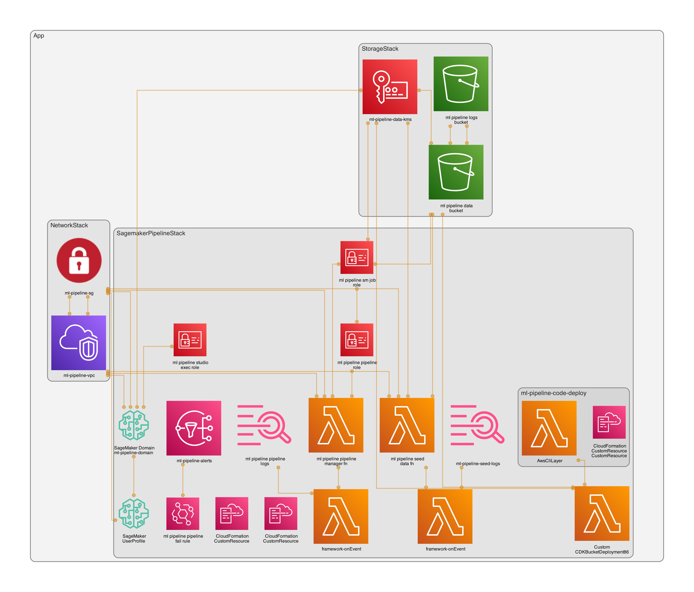

# SageMaker Secure Pipeline Example (CDK / TypeScript)

This example project provisions a secure, VPC-only SageMaker Studio environment and a minimal SageMaker Pipeline for tabular classification using AutoGluon. It seeds synthetic CSV data into S3, runs preprocessing (split), training, and deploys a real-time endpoint. Failure alarms are sent to an SNS topic via EventBridge.

## Architecture Overview

- Multi-stack CDK app, security-first, no-NAT VPC-only design.
- Base infra (VPC, KMS, S3, IAM, Studio) in CDK.
- SageMaker Pipeline lifecycle via a custom resource using the SageMaker SDK for flexibility and reliability.
- Data and code kept in a single data bucket with clear prefixes.

## What it creates

- NetworkStack
  - VPC with isolated subnets (no NAT)
  - Endpoints: S3 (gateway) and interface endpoints for SageMaker API/Runtime/Studio, ECR API/DKR, CloudWatch Logs, STS
  - Security Group for Studio and jobs

- StorageStack
  - KMS CMK (rotation enabled) for data
  - Data bucket (prefixes: `raw/`, `processed/`, `models/`) with access logging
  - Access logging bucket (public access blocked)
- SagemakerPipelineStack
  - SageMaker Studio Domain (IAM auth, VPC-only) and user profile `weirdion`
  - IAM roles for Studio execution, SageMaker jobs, and pipeline
  - Data seeding Lambda + custom resource (generates `raw/data.csv`)
  - Pipeline manager Lambda + custom resource (creates/updates/deletes pipeline via SDK)
  - Pipeline: Processing → Training → CreateModel → EndpointConfig → Endpoint
  - EventBridge rule → SNS topic on pipeline failure

## Deploy
Pre-reqs: CDK bootstrapped account, AWS credentials configured. The stack uses your CLI region.

Commands:
- `npm install`
- `npm run build`
- `npx cdk synth`
- `npx cdk deploy`
- `npm run visualize`

Outputs include bucket names, Studio Domain ID, user profile, pipeline name, and SNS topic.

## Notes
- This PoC sets `RemovalPolicy.DESTROY` and `autoDeleteObjects: true` on buckets/logs for clean teardown. For production, switch to RETAIN.
- DLC image URIs for AutoGluon/Sklearn may need version updates per region. Adjust in `lib/sagemaker-pipeline-stack.ts`.
- The pipeline deploys a real-time endpoint automatically; consider gating behind evaluation for production.

## Cost Estimate (Infra Only)
Infra costs ONLY (EXCLUDES preprocessing/training jobs and live inference):

- VPC Endpoints (Interface)
  - ~$0.01–$0.014 per AZ-hour per endpoint (region-dependent) + data processing ($/GB)
  - Typical: 7 endpoints × 2 AZs
  - Formula: endpoints × AZs × hourly_rate × 730
  - Example: 7 × 2 × $0.01 × 730 = ~$102/month (+ data processing)
- VPC Endpoint (Gateway for S3)
  - No hourly charge; standard S3 request/data charges apply
- S3 Buckets
  - Storage (data + access logs) and requests. Small PoC footprints usually a few dollars/month
- KMS CMK
  - ~$1/month per key + API requests
- CloudWatch Logs
  - Ingest + storage only; small under light use (Lambda logs)
- Lambda (pipeline manager, data seed)
  - Request + compute time; negligible for infrequent short runs
- EventBridge + SNS
  - EventBridge rules no cost; SNS charges per request/notification (minimal without subscriptions)
- IAM, Security Groups
  - No direct cost

>Pricing varies by region and usage.
> 
>Always use the AWS Pricing Calculator for precise estimates.

>Compute costs for SageMaker jobs/endpoints are not included here and can dominate spend when active.
